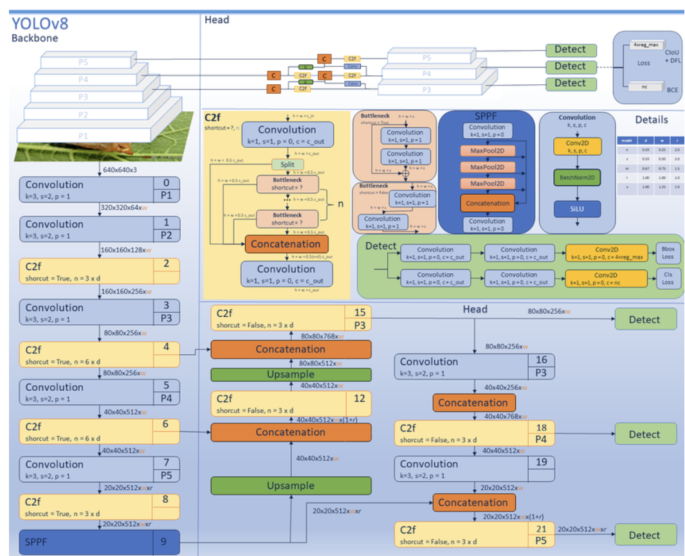

# Pollen Bee Detection

Custom YOLOv8-style object detection pipeline for detecting two bee classes in the VnPollenBee dataset:

- `nonpollenbee`
- `pollenbee`

This project implements its own YOLOv8-style model in PyTorch. It is not the official Ultralytics YOLOv8 package, although the architecture follows YOLOv8 concepts such as C2f blocks, an anchor-free detection head, DFL box regression, and YOLO-style detection losses.

## Project Structure

```text
pollenbees/
  phase1_pipeline_v2.py        # Main training and validation pipeline
  yolov8_model.py              # Custom YOLOv8-style model implementation
  sanity_check.py              # Annotation conversion visualization helper
  verify_env.py                # CUDA and dependency verification
  setup_env.ps1                # Windows environment setup helper
  requirements.txt             # Core Python dependencies
  requirements-cuda.txt        # PyTorch CUDA dependency set
  requirements-local.txt       # Local dependency set used by setup_env.ps1
  utils/
    args.yaml                  # Loss weights and training-related config
    util.py                    # Loss, assigner, NMS utilities
  train/
    images/
    annotations_only_non_and_pollenbee_fixed_final/
    labels/
  val/
    images/
    annotations_only_non_and_pollenbee_fixed_final/
    labels/
  test/
    images/
    annotations_only_non_and_pollenbee_fixed_final/
    labels/
  runs/
    baseline/                  # Training outputs and checkpoints
    results/                   # Per-epoch CSV metrics for model comparison
```

## Dataset Layout

Each split should contain:

```text
split/
  images/                                           # JPG/PNG images
  annotations_only_non_and_pollenbee_fixed_final/   # Labelme JSON annotations
  labels/                                           # YOLO txt labels generated by the pipeline
```

The pipeline converts Labelme JSON annotations into YOLO-format text labels:

```text
class_id cx cy w h
```

All box coordinates are normalized to `[0, 1]`.

Current converted dataset counts:

| Split | Images | nonpollenbee instances | pollenbee instances |
| --- | ---: | ---: | ---: |
| train | 1496 | 43460 | 1324 |
| val | 381 | 10796 | 307 |
| test | 174 | 4812 | 127 |

The dataset is heavily imbalanced. Pollenbee is roughly 3 percent of the labeled instances, so per-class AP is more important than the overall mAP alone.

## Model

The model is defined in `yolov8_model.py`.



Key components:

- Custom YOLOv8-style backbone and neck
- C2f-style blocks
- Anchor-free detection head
- Strides: `8`, `16`, `32`
- Distribution Focal Loss box regression
- Two detection classes
- Optional attention modules (CBAM and/or a BoTNet MHSA stack), selectable per run

### Attention modes

The backbone supports four attention configurations, selected with the
`POLLENBEES_ATTN` environment variable (see Training). This makes the
baseline-vs-attention ablation reproducible from a single codebase:

| `POLLENBEES_ATTN` | CBAM (P3/P4/P5) | P5 block | ~Params (s) |
| --- | --- | --- | ---: |
| `none` (default) | off | C2f | 11.14M |
| `cbam` | on | C2f | 11.22M |
| `botnet` | off | BoTNet MHSA stack | 9.85M |
| `cbam_botnet` | on | BoTNet MHSA stack | 9.94M |

- CBAM is applied to the three feature maps feeding the neck; it is
  shape-preserving, so the neck and head are unchanged.
- The P5 stage uses either the standard C2f block or a shape-preserving
  BoTNet (Bottleneck Transformer / MHSA) stack. The BoTNet stack bakes in
  `fmap_size=20`, which assumes the default `640x640` input (P5 = 640/32 = 20).
  Changing the image size requires updating that value in `yolov8_model.py`.
- Note that BoTNet replaces C2f with a lighter block, so the attention
  variants have fewer parameters than the baseline, not more.

A self-check for all four modes is built into the model file:

```powershell
python yolov8_model.py
```

It confirms every mode builds, forwards a `640x640` tensor, and that the
toggle actually changes the model.

Use this wording in reports:

> We implemented a custom YOLOv8-style detector based on the YOLOv8 architecture.

Avoid saying that the project uses Ultralytics YOLOv8 unless the official `ultralytics` package is used.

## Environment Setup

### Option 1: Full CUDA install

```powershell
python -m venv .venv
.\.venv\Scripts\Activate.ps1
python -m pip install --upgrade pip setuptools wheel
python -m pip install -r requirements-cuda.txt
python verify_env.py
```

### Option 2: Local setup helper

`setup_env.ps1` assumes Python 3.12 and uses system site packages. This is useful if CUDA PyTorch is already installed outside the virtual environment.

```powershell
.\setup_env.ps1
.\.venv\Scripts\Activate.ps1
```

If `verify_env.py` reports that CUDA is unavailable, install the CUDA PyTorch packages from `requirements-cuda.txt`.

## Training

Run the full pipeline:

```powershell
python phase1_pipeline_v2.py
```

The script will:

1. Detect CUDA if available.
2. Convert Labelme JSON annotations to YOLO labels if needed.
3. Build train and validation datasets.
4. Train the custom YOLOv8-style model.
5. Evaluate validation metrics after each epoch.
6. Append one metrics row per epoch to `runs/results/`.
7. Save the best checkpoint to:

```text
runs/baseline/best.pt
```

Training history is saved to:

```text
runs/baseline/history.json
```

Per-epoch comparison metrics are saved as:

```text
runs/results/custom_yolov8s_baseline_<run_id>.csv
```

### Selecting an attention variant

Pick the backbone configuration with `POLLENBEES_ATTN` before training. Each
variant writes a separately named CSV, so the four ablation runs stay
distinct and correctly labeled:

```powershell
$env:POLLENBEES_ATTN = "none"          # baseline: C2f at P5, no CBAM
$env:POLLENBEES_ATTN = "cbam"          # CBAM only
$env:POLLENBEES_ATTN = "botnet"        # BoTNet MHSA only
$env:POLLENBEES_ATTN = "cbam_botnet"   # combined
python phase1_pipeline_v2.py
```

With no `POLLENBEES_ATTN` set, the default is `none` (the plain baseline).

### Training environment variables

All training customization is done through environment variables. Nothing
below needs a code edit:

| Variable | Default | Effect |
| --- | --- | --- |
| `POLLENBEES_ATTN` | `none` | Attention mode: `none` / `cbam` / `botnet` / `cbam_botnet` |
| `POLLENBEES_EPOCHS` | `100` | Number of training epochs |
| `POLLENBEES_MODEL_NAME` | derived from `POLLENBEES_ATTN` | Run/model name used for the results CSV |
| `POLLENBEES_RUN_ID` | current timestamp | Run ID suffix on the CSV filename |

The default model name is derived from the attention mode:
`none` maps to `custom_yolov8s_baseline`, and every other mode maps to
`custom_yolov8s_<attn>` (for example `custom_yolov8s_cbam_botnet`). Set
`POLLENBEES_MODEL_NAME` only to override that.

For a custom-named comparison run:

```powershell
$env:POLLENBEES_ATTN = "cbam_botnet"
$env:POLLENBEES_MODEL_NAME = "my_model_variant"
python phase1_pipeline_v2.py
```

This produces:

```text
runs/results/my_model_variant_<run_id>.csv
```

Hyperparameters not exposed as environment variables (image size `640`,
batch size `16`, optimizer, scheduler, learning rate) are defined near the
top of the `main` block in `phase1_pipeline_v2.py`.

## Evaluation

Validation logs include:

```text
mAP@0.50
mAP@0.50:0.95
AP@0.50 [nonpollenbee]
AP@0.50 [pollenbee]
AP@0.50:0.95 [nonpollenbee]
AP@0.50:0.95 [pollenbee]
precision/recall/F1 [nonpollenbee]
precision/recall/F1 [pollenbee]
```

The per-class values matter most for this dataset. A high `nonpollenbee` AP with `pollenbee` AP near zero means the model has learned the majority class but is failing on the minority class.

The CSV file contains:

```text
run_id
model_name
epoch
lr
train_loss
map_50
map_50_95
stats_conf_thr
stats_iou_thr
nonpollenbee_precision
nonpollenbee_recall
nonpollenbee_f1
nonpollenbee_tp
nonpollenbee_fp
nonpollenbee_fn
pollenbee_precision
pollenbee_recall
pollenbee_f1
pollenbee_tp
pollenbee_fp
pollenbee_fn
```

AP is computed from ranked low-threshold detections. Precision, recall, and F1 are computed from fixed-threshold detections using `stats_conf_thr = 0.25` and `stats_iou_thr = 0.50` by default.

The current pipeline includes:

- Low-threshold ranked detections for AP calculation
- Class-wise NMS
- Real `mAP@0.50:0.95` IoU sweep
- Varifocal classification loss with smaller positive class weighting for `pollenbee`
- A widened classification head in `yolov8_model.py`

Because the model architecture was updated, old checkpoints in `runs/baseline/` should be treated as outdated. Retrain from scratch after these changes.

## Annotation Sanity Check

Use `sanity_check.py` to visually confirm annotation conversion. Edit these paths inside the file before running:

```python
JSON_PATH = "path/to/sample.json"
IMG_PATH = "path/to/sample.jpg"
OUT_PATH = "sanity_check_result.jpg"
```

Then run:

```powershell
python sanity_check.py
```

The output image draws converted bounding boxes so the label format can be checked visually.

## Important Configuration

Loss and class weighting are configured in:

```text
utils/args.yaml
```

Current classification loss setup:

```yaml
cls_loss_type: vfl
vfl_alpha: 0.75
vfl_gamma: 2.0
vfl_iou_weighted: true
cls_pos_weight:
  - 1.0
  - 4.0
```

This uses Varifocal Loss for class prediction and gives positive `pollenbee` targets a smaller extra weight than the earlier BCE experiment. The `4.0` weight is intentionally conservative so the model is encouraged to learn pollenbee without immediately producing many false pollenbee detections.

The attention mode, epoch count, and run naming are set with environment
variables (see the Training section). The remaining training hyperparameters
are defined near the top of the `main` block in `phase1_pipeline_v2.py`:

- image size: `640`
- batch size: `16`
- epochs: `100` (override with `POLLENBEES_EPOCHS`)
- optimizer: SGD
- scheduler: cosine annealing

## Troubleshooting

### Pollenbee AP is zero

Check the per-class logs. If `AP [nonpollenbee]` is high and `AP [pollenbee]` is zero, the model is likely biased toward the majority class. Retrain with the current class-weighted loss and widened classification head.

### `mAP@0.50` and `mAP@0.50:0.95` are identical

That usually means evaluation is only using IoU `0.50`. The current `evaluate()` function uses the full `0.50:0.95` IoU sweep.

### CUDA is not available

Run:

```powershell
python verify_env.py
```

If CUDA is unavailable, reinstall dependencies from:

```powershell
python -m pip install -r requirements-cuda.txt
```

### Label conversion is skipped

This is expected when `labels/` already exists and contains the same number of files as the JSON annotation folder. Delete the split's `labels/` folder only if annotations changed and labels must be regenerated.
